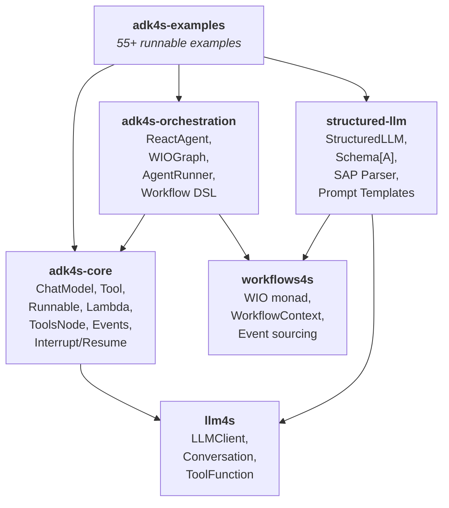

# ADK4S — Agent Development Kit for Scala 3

ADK4S is a functional, type-safe agent toolkit for Scala 3. It builds on [LLM4S](https://github.com/llm4s/llm4s) (the Scala LLM client) and [workflows4s](https://github.com/business4s/workflows4s) (the workflow engine) to provide a complete stack for building LLM-powered agents, from structured outputs to multi-agent orchestration.

**Core idea**: compose LLM calls, tools, and workflows as pure functions using Cats Effect and fs2 — with built-in observability, interrupt/resume, and type-safe structured outputs.



## What LLM4S Provides (Foundation)

LLM4S is the LLM client layer that adk4s builds on:

- **LLMClient** — provider-agnostic client for OpenAI, Anthropic, etc.
- **Conversation / Message types** — `UserMessage`, `AssistantMessage`, `ToolMessage`, `SystemMessage`
- **Completion / StreamedChunk** — response types for sync and streaming calls
- **ToolFunction[I, O]** — single tool interface with parameter extraction
- **ToolRegistry** — tool lookup and registration
- **LLMError** — error hierarchy for provider failures

## What ADK4S Adds

### ChatModel — Effect-Polymorphic LLM Interface

Wraps llm4s' callback-based `LLMClient` with a functional API built on Cats Effect and fs2:

```scala
import cats.effect.IO
import org.adk4s.core.component.ChatModel

trait ChatModel[F[_]]:
  def generate(conversation: Conversation): F[Completion]
  def stream(conversation: Conversation): fs2.Stream[F, StreamedChunk]
  def streamContent(conversation: Conversation): fs2.Stream[F, String]
  def withConfig(config: ChatModelConfig): ChatModel[F]
```

Supports configuration (temperature, maxTokens, topP, stopSequences) and converts llm4s' `Iterator`-based streaming into proper `fs2.Stream`.

### Three-Tier Tool System

LLM4S has a single `ToolFunction[I, O]`. ADK4S provides three levels of abstraction that interoperate:

```scala
// Level 1: Base trait (metadata only)
trait Tool[F[_]]:
  def info: AdkToolInfo
  def asToolFunction: Option[ToolFunction[Any, Any]]

// Level 2: Synchronous execution
trait InvokableTool[F[_]] extends Tool[F]:
  def run(arguments: ujson.Value): F[ujson.Value]

// Level 3: Streaming execution
trait StreamableTool[F[_]] extends Tool[F]:
  def runStream(arguments: ujson.Value): fs2.Stream[F, String]
```

Factory methods for quick tool creation:

```scala
val weatherTool: InvokableTool[IO] = Tool.invokable[IO](
  name = "get_weather",
  description = "Get weather for a location",
  handler = (args: ujson.Value) => Right(ujson.Str(s"Weather in ${args.obj("location").str}"))
)
```

### ToolsNode — Tool Execution Engine

Executes LLM tool calls with middleware pipelines, parallel/sequential strategies, and event emission:

```scala
val config: ToolsNodeConfig = ToolsNodeConfig.builder
  .withAdkTool(weatherTool)
  .withMiddleware(ToolMiddleware.logging((msg: String) => IO.println(msg)))
  .withMiddleware(ToolMiddleware.timing((name: String, ms: Long) => IO.println(s"$name: ${ms}ms")))
  .withUnknownHandler((name: String, _: String) => IO.pure(s"Tool '$name' not available"))
  .parallel(maxConcurrency = 5)
  .build

val toolsNode: ToolsNode = ToolsNode(config)
val result: IO[ToolExecutionResult] = toolsNode.executeFromToolCalls(calls)
```

Both llm4s `ToolFunction` and ADK `InvokableTool` can coexist in the same ToolsNode.

### Runnable — Universal Computation Abstraction

A single interface supporting four execution modes:

```scala
trait Runnable[I, O]:
  def invoke(input: I): IO[O]                         // single in, single out
  def stream(input: I): fs2.Stream[IO, O]             // single in, streamed out
  def collect(input: fs2.Stream[IO, I]): IO[O]        // streamed in, single out
  def transform(input: fs2.Stream[IO, I]): fs2.Stream[IO, O] // streamed in, streamed out
```

Runnables compose with `andThen`, `parallel`, `timeout`, `handleError`, and `contramap`:

```scala
val pipeline: Runnable[String, String] =
  parse.andThen(double).andThen(toString)
    .timeout(30.seconds)
    .handleError((_: Throwable) => IO.pure("-1"))
```

All ADK4S components convert to Runnables: `ChatModel` becomes `Runnable[Conversation, Completion]`, `InvokableTool` becomes `Runnable[ujson.Value, ujson.Value]`.

### Lambda — Runnable with Metadata

Wraps a Runnable with a name and description for introspection:

```scala
val toUpper: Lambda[String, String] = Lambda.pure((input: String) => input.toUpperCase)
val fetchData: Lambda[String, String] = Lambda((url: String) => IO(url.reverse))
val tokenize: Lambda[String, String] = Lambda.stream((text: String) =>
  Stream.emits(text.split(" ").toList)
)
```

### ReactAgent — ReAct Loop

Implements the Reasoning + Acting agent loop: call the LLM, execute tool calls, feed results back, repeat until the LLM produces a final response:

```scala
val agent: ReactAgent = ReactAgent.create(
  name = "assistant",
  description = "General-purpose assistant",
  model = chatModel,
  tools = List(searchTool, calculatorTool),
  systemPrompt = Some("You are a helpful assistant."),
  maxSteps = 10
)

val result: IO[AssistantMessage] = agent.generate(
  List(UserMessage("What is the weather in Rome?")),
  maxSteps = 5
)
```

### AgentTool — Nested Agent Composition

Wraps an Agent as an `InvokableTool`, enabling multi-level hierarchies where a parent agent delegates to specialist sub-agents via tool calls:

```scala
val researchAgent: ReactAgent = ReactAgent.create("research", ...)
val researchTool: InvokableTool[IO] <- AgentTool.fromAgent(researchAgent)

val orchestrator: ReactAgent = ReactAgent.create(
  "orchestrator", "Coordinates specialists",
  model, List(researchTool), ...
)
```

### AgentEvent — Real-Time Observability

Structured event emission during agent execution. Events carry a `RunPath` showing the execution hierarchy:

```scala
sealed trait AgentEvent:
  def runPath: RunPath

// Event types:
AgentEvent.MessageOutput(runPath, message, role)
AgentEvent.ToolCallRequested(runPath, toolName, arguments, callId)
AgentEvent.ToolCallCompleted(runPath, toolName, result, callId, isError)
AgentEvent.IterationCompleted(runPath, iteration, remainingSteps)
AgentEvent.Interrupted(runPath, signal)
AgentEvent.ErrorOccurred(runPath, error)
AgentEvent.TokenDelta(runPath, delta)
```

Events flow through nested agent boundaries via `AgentEventEmitter.scoped(step)`, enabling full visibility into hierarchical execution.

### Interrupt / Resume — Pauseable Agents

Tools can interrupt execution mid-stream. The interrupt signal carries state, an address (where in the hierarchy it occurred), and a human-readable reason:

```scala
sealed trait InterruptSignal:
  def address: List[AddressSegment]  // execution location
  def info: String                    // human-readable reason

// Variants:
InterruptSignal.Simple(address, info)
InterruptSignal.Stateful(address, info, state: ujson.Value)
InterruptSignal.Composite(address, info, state, children: List[InterruptSignal])
```

`AgentRunner` manages the interrupt/resume lifecycle with checkpoint persistence:

```scala
val runner: AgentRunner = AgentRunner.create(agent, checkpointStore, emitter)

// Run until completion or interrupt
val result: IO[RunResult] = runner.run(messages)

// Resume from checkpoint with human-provided data
val resumed: IO[RunResult] = runner.resume(checkpointId, List(
  InterruptResult(address = List(AddressSegment.Tool("payment")),
                  data = ujson.Obj("approved" -> true))
))
```

### Structured LLM — Type-Safe LLM Outputs

A BAML-inspired system that enforces structured outputs from LLMs. Injects Smithy IDL schemas into prompts and parses responses with a lenient Schema-Aligned Parser (SAP):

```scala
// 1. Define schema (Smithy IDL injected into prompt, smithy4s schema for decoding)
given Schema[Resume] = Schema.instance(
  """structure Resume {
    |  @required name: String
    |  skills: StringList
    |}""".stripMargin
)(using summon[Smithy4sSchema[Resume]])

// 2. Call LLM with type-safe completion
val structured: StructuredLLM[IO] = StructuredLLM.fromClient(llmClient)
val resume: IO[Resume] = structured.complete[Resume](
  Prompt.simple("You are a parser", "Extract resume from: John Doe, Python, 5 years")
)
```

SAP recovers from common LLM output issues: markdown code fences, trailing commas, single quotes, unquoted keys, comments, and truncated responses.

### WIOGraph — DAG-Based Workflow Orchestration

Builds on workflows4s' WIO monad to define type-safe directed acyclic graphs that compile to executable workflows:

```scala
val graph: WIOGraph[MyCtx, Input, Nothing, Output] = WIOGraph.builder[MyCtx, Input, Nothing, Output]
  .addNode(validateNode)
  .addNode(processNode)
  .addNode(outputNode)
  .addEdge(validateNode.ref, processNode.ref)
  .addEdge(processNode.ref, outputNode.ref)
  .setEntryNode(validateNode.ref)
  .addEndNode(outputNode.ref)
  .build

// Compile to WIO or Runnable
val wio: WIO[Input, Nothing, Output, MyCtx] = graph.toWIO
val runnable: Runnable[Input, Output] = graph.toRunnable
```

Node types: `WIOPureNode` (pure), `WIORunIONode` (effectful), `WIORunnableNode` (Runnable-based), `WIOForkNode` (conditional branching), `WIOForEachNode` (collection processing), `WIOSubGraphNode` (nested graphs). Nodes support modifiers: checkpoint, retry, and interruption.

## Modules

| Module | Purpose |
|--------|---------|
| **adk4s-core** | ChatModel, Tool, Runnable, Lambda, ToolsNode, AgentEvent, InterruptSignal, Streaming, Error types |
| **adk4s-orchestration** | ReactAgent, AgentRunner, WIOGraph, Workflow DSL, State management, Graph execution |
| **structured-llm** | StructuredLLM, Schema[A], SchemaAlignedParser, PromptTemplate |
| **structured-llm-test-models** | Smithy schema definitions and tests for structured-llm |
| **adk4s-examples** | 55+ runnable examples across all modules |

### External Dependencies

| Dependency | What it provides |
|------------|-----------------|
| [llm4s](https://github.com/llm4s/llm4s) | LLMClient, Conversation, Message types, ToolFunction, ToolRegistry |
| [workflows4s](https://github.com/business4s/workflows4s) | WIO monad, WorkflowContext, event sourcing, signal routing |
| [smithy4s](https://disneystreaming.github.io/smithy4s/) | Schema generation from Smithy IDL, JSON encoding/decoding |
| [Cats Effect 3](https://typelevel.org/cats-effect/) | IO monad, Ref, concurrent primitives |
| [fs2](https://fs2.io/) | Functional streaming |

## Examples

The `adk4s-examples` module contains 55+ runnable examples organized by category.

### Running Examples

**Prerequisites**: JDK 17+, sbt

#### With Mock LLM (no API key needed)

All examples include built-in mock models that produce deterministic responses:

```bash
# Via run-example.sh (recommended)
./adk4s-examples/run-example.sh reactagent
./adk4s-examples/run-example.sh compositeinterrupt
./adk4s-examples/run-example.sh --mock chatmodel

# Via sbt directly
sbt "adk4s-examples/runMain org.adk4s.examples.eino.agent.ReactAgentExample"
sbt "adk4s-examples/runMain org.adk4s.examples.eino.agent.CompositeInterruptExample"
```

#### With Real LLM (OpenAI API)

Set the `OPENAI_API_KEY` environment variable. Examples auto-detect it and switch from mock to real:

```bash
export OPENAI_API_KEY="sk-..."
export LLM_MODEL="gpt-4o-mini"              # optional, defaults to gpt-4o-mini
export OPENAI_BASE_URL="https://api.openai.com/v1"  # optional

./adk4s-examples/run-example.sh chatmodel
./adk4s-examples/run-example.sh reactagent
```

Any OpenAI-compatible API works (set `OPENAI_BASE_URL` to your provider's endpoint).

#### Run All Examples

```bash
./adk4s-examples/run-example.sh all
./adk4s-examples/run-example.sh --help   # list all available examples
```

### Example Categories

#### Components (`eino/components/`)

Basic building blocks — how to use each core component in isolation.

| Example | What it demonstrates |
|---------|---------------------|
| `ChatModelExample` | ChatModel with generate and stream, mock fallback |
| `ChatTemplateExample` | Prompt templates with variable substitution |
| `LambdaExample` | Lambda creation, composition, and streaming |
| `ToolSchemaExample` | Tool schema derivation and JSON schema generation |
| `RetrieverExample` | Document retrieval abstraction |
| `DocumentLoaderExample` | Document loading and chunking |

#### Graphs (`eino/graph/`)

Graph-based computation with nodes, edges, and execution strategies.

| Example | What it demonstrates |
|---------|---------------------|
| `SimpleGraphExample` | Basic graph with linear node chain |
| `StateGraphExample` | Stateful graph with mutable state |
| `ToolCallAgentExample` | Graph with LLM + tool calling loop |
| `ToolCallOnceExample` | Single-shot tool execution in a graph |
| `TwoModelChatExample` | Two LLMs conversing through a graph |
| `AsyncNodeExample` | Async/concurrent nodes in graphs |
| `ReactWithInterruptExample` | Graph with interrupt/resume support |

#### Workflows (`eino/workflow/`)

Higher-level workflow DSL with field mapping and branching.

| Example | What it demonstrates |
|---------|---------------------|
| `SimpleWorkflowExample` | Linear workflow with Lambda nodes |
| `BranchWorkflowExample` | Conditional branching in workflows |
| `StaticValuesExample` | Injecting static values into workflow |
| `FieldMappingWorkflowExample` | Field-level data mapping between nodes |
| `DataOnlyWorkflowExample` | Data transformation workflow (no LLM) |
| `StreamFieldMapExample` | Streaming with field mapping |

#### Agents (`eino/agent/`)

Agent patterns from simple ReAct to multi-agent hierarchies with interrupt/resume.

| Example | What it demonstrates |
|---------|---------------------|
| `ReactAgentExample` | Basic ReAct loop with tools |
| `ReactMemoryExample` | Agent with conversation memory |
| `MultiAgentHostExample` | Multiple agents coordinating |
| `PlanExecuteExample` | Plan-then-execute agent pattern |
| `DynamicOptionExample` | Dynamic tool selection |
| `AgentToolExample` | Wrapping an agent as a tool |
| `AgentToolAdvancedExample` | fromFunction, fromReactAgent, custom schemas |
| `NestedAgentDelegationExample` | 3-level hierarchy: Supervisor > Specialist > Sub-specialist |
| `CompositeInterruptExample` | Multiple tools interrupting simultaneously |
| `StatefulResumeExample` | State persistence across interrupt/resume |
| `HierarchicalEventStreamExample` | Event streaming through nested agents |
| `InterruptResumeExample` | Basic interrupt and resume flow |
| `EventStreamExample` | Real-time event consumption |

#### Structured LLM (`structured/`)

Type-safe structured outputs with Schema-Aligned Parser.

| Example | What it demonstrates |
|---------|---------------------|
| `QueryClassificationStructuredExample` | Classifying user queries into categories |
| `RoleDetectionStructuredExample` | Detecting user roles from text |
| `CategoryClassificationStructuredExample` | Multi-category classification |
| `ChainRouteStructuredExample` | Chain routing based on classification |
| `SchemaExtractionStructuredExample` | Extracting structured data from text |
| `StepsExtractionStructuredExample` | Extracting ordered steps |
| `ListParsingStructuredExample` | Parsing lists from LLM output |
| `PlanExecuteStructuredExample` | Plan-execute with typed intermediates |
| `ChainCompositionStructuredExample` | Composing typed chains |
| `TypedIntermediatesStructuredExample` | Type-safe intermediate values |
| `TransformChainStructuredExample` | Transform chains with structured I/O |
| `MultiAgentHostStructuredExample` | Multi-agent with structured delegation |
| `SpecialistDelegationStructuredExample` | Specialist routing with typed outputs |
| `ReactAgentStructuredExample` | ReAct agent with structured tools |
| `DynamicToolRegistryStructuredExample` | Dynamic tool registration with schemas |
| `WIOGraphToolStructuredExample` | WIOGraph with structured tool nodes |
| `SAPErrorRecoveryStructuredExample` | SAP recovery from malformed JSON |

#### Batch & Quickstart

| Example | What it demonstrates |
|---------|---------------------|
| `BatchExample` | Batch processing of multiple inputs |
| `ChatExample` | Minimal quickstart example |

## Build Commands

```bash
sbt compile                    # compile all modules
sbt test                       # run all tests
sbt "adk4s-core/test"          # test core module only
sbt "adk4s-orchestration/test" # test orchestration module only
sbt scalafmt                   # format code
sbt assembly                   # build fat JAR
```

## License

[MIT](LICENSE)
