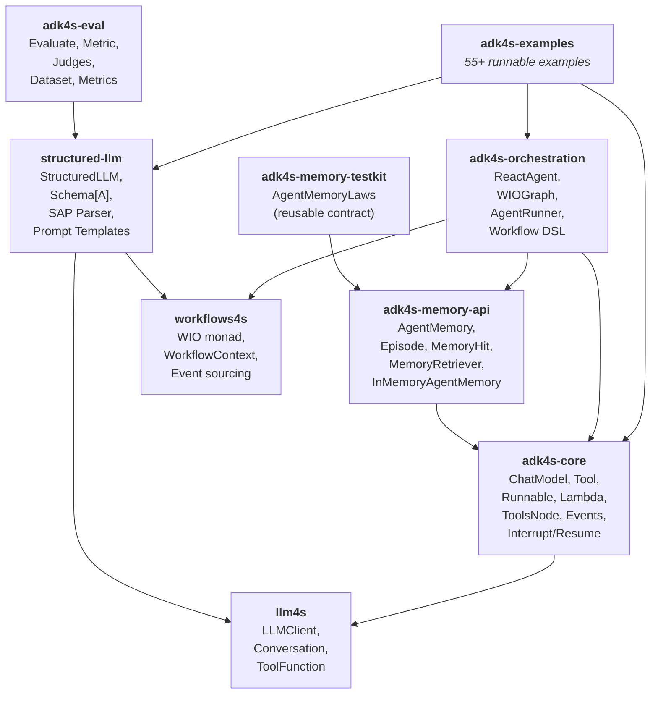

# ADK4S — Agent Development Kit for Scala 3

ADK4S is a functional, type-safe agent toolkit for Scala 3. It builds on [LLM4S](https://github.com/llm4s/llm4s) (the Scala LLM client) and [workflows4s](https://github.com/business4s/workflows4s) (the workflow engine) to provide a complete stack for building durable LLM-powered agents, from structured outputs to multi-agent orchestration.

**Core idea**: compose LLM calls, tools, and workflows as pure functions using Cats Effect and fs2 — with built-in observability, interrupt/resume, and type-safe structured outputs.

## Key Features

- **Durable agent memory** — agents remember across sessions, with temporal scoping and a contract suite for backend implementers.
- **DAG workflows** — type-safe directed acyclic graphs with validated edges, compiled to an executable workflow. Nodes support checkpointing, retry, and interruption.
- **DSPy-inspired Evaluation harness** — run a program over a labeled dataset in parallel, score with exact-match or LLM judges, export to JSON or CSV.
- **Memory-orchestrated execution** — an opt-in decorator recalls facts before each turn and writes new ones after, skipping failed or interrupted runs.
- **ReAct agents** — a built-in loop calls the LLM, runs tools, and iterates until a final answer, with a configurable step budget.
- **Type-safe structured outputs** — declare the shape you want, inject it into the prompt, and parse the response into typed values. A lenient parser recovers from messy LLM JSON.
- **Real-time observability** — a structured event stream surfaces every message, tool call, iteration, interrupt, and error, traced through nested agents.
- **Provider-agnostic LLM access** — one interface for OpenAI, Anthropic, and any compatible endpoint, sync or streaming.
- **Tool execution engine** — parallel or sequential runs with composable middleware (logging, timing, JSON repair, custom).
- **Universal computation primitive** — LLM calls, tools, and workflows are the same kind of value, so they compose uniformly.
- **Multi-agent hierarchies** — any agent can be wrapped as a tool, so parents delegate to specialist sub-agents recursively.
- **Interrupt and resume** — tools pause mid-flight with their location and state; humans review and resume from the checkpoint.
- **Functional & type-safe** — pure functions, immutable data, no escape hatches. The compiler is on your side.
- **Streaming everywhere** — LLM tokens, tool output, and events all flow as functional streams.
- **Multi-ring verification** — static analysis, mutation testing, and formal verification back the core abstractions.
- **55+ runnable examples** — mock LLM by default (no API key needed), auto-switches to a real provider when a key is present.


```mermaid
graph TD
    examples["<b>adk4s-examples</b><br/><i>55+ runnable examples</i>"]

    core["<b>adk4s-core</b><br/>ChatModel, Tool,<br/>Runnable, Lambda,<br/>ToolsNode, Events,<br/>Interrupt/Resume"]
    orchestration["<b>adk4s-orchestration</b><br/>ReactAgent,<br/>WIOGraph,<br/>AgentRunner,<br/>Workflow DSL"]
    structured["<b>structured-llm</b><br/>StructuredLLM,<br/>Schema[A],<br/>SAP Parser,<br/>Prompt Templates"]
    memoryApi["<b>adk4s-memory-api</b><br/>AgentMemory,<br/>Episode, MemoryHit,<br/>MemoryRetriever,<br/>InMemoryAgentMemory"]
    memoryTestkit["<b>adk4s-memory-testkit</b><br/>AgentMemoryLaws<br/>(reusable contract)"]
    eval["<b>adk4s-eval</b><br/>Evaluate, Metric,<br/>Judges,<br/>Dataset, Metrics"]

    llm4s["<b>llm4s</b><br/>LLMClient,<br/>Conversation,<br/>ToolFunction"]
    workflows4s["<b>workflows4s</b><br/>WIO monad,<br/>WorkflowContext,<br/>Event sourcing"]

    examples --> core
    examples --> orchestration
    examples --> structured

    core --> llm4s
    orchestration --> core
    orchestration --> workflows4s
    orchestration --> memoryApi
    structured --> llm4s
    structured --> workflows4s
    memoryApi --> core
    memoryTestkit --> memoryApi
    eval --> structured
```

> 💡 All code snippets below are collapsed by default. Click each one to expand it.

## What LLM4S Provides (Foundation)

LLM4S is the LLM client layer that adk4s builds on:

- **LLMClient** — provider-agnostic client for OpenAI, Anthropic, etc.
- **Conversation / Message types** — `UserMessage`, `AssistantMessage`, `ToolMessage`, `SystemMessage`
- **Completion / StreamedChunk** — response types for sync and streaming calls
- **ToolFunction[I, O]** — single tool interface with parameter extraction
- **ToolRegistry** — tool lookup and registration
- **LLMError** — error hierarchy for provider failures

## What ADK4S Adds

### ChatModel — Effect-Polymorphic LLM Interface

Wraps llm4s' callback-based `LLMClient` with a functional API built on Cats Effect and fs2:

<details>
<summary>Show code — ChatModel trait</summary>

```scala
import cats.effect.IO
import org.adk4s.core.component.ChatModel

trait ChatModel[F[_]]:
  def generate(conversation: Conversation): F[Completion]
  def stream(conversation: Conversation): fs2.Stream[F, StreamedChunk]
  def streamContent(conversation: Conversation): fs2.Stream[F, String]
  def withConfig(config: ChatModelConfig): ChatModel[F]
```

</details>

Supports configuration (temperature, maxTokens, topP, stopSequences) and converts llm4s' `Iterator`-based streaming into proper `fs2.Stream`.

### Three-Tier Tool System

LLM4S has a single `ToolFunction[I, O]`. ADK4S provides three levels of abstraction that interoperate:

<details>
<summary>Show code — Three-tier tool traits</summary>

```scala
// Level 1: Base trait (metadata only)
trait Tool[F[_]]:
  def info: AdkToolInfo
  def asToolFunction: Option[ToolFunction[Any, Any]]

// Level 2: Synchronous execution
trait InvokableTool[F[_]] extends Tool[F]:
  def run(arguments: ujson.Value): F[ujson.Value]

// Level 3: Streaming execution
trait StreamableTool[F[_]] extends Tool[F]:
  def runStream(arguments: ujson.Value): fs2.Stream[F, String]
```

</details>

Factory methods for quick tool creation:

<details>
<summary>Show code — Tool factory example</summary>

```scala
val weatherTool: InvokableTool[IO] = Tool.invokable[IO](
  name = "get_weather",
  description = "Get weather for a location",
  handler = (args: ujson.Value) => Right(ujson.Str(s"Weather in ${args.obj("location").str}"))
)
```

</details>

### ToolsNode — Tool Execution Engine

Executes LLM tool calls with middleware pipelines, parallel/sequential strategies, and event emission:

<details>
<summary>Show code — ToolsNode configuration and execution</summary>

```scala
val config: ToolsNodeConfig = ToolsNodeConfig.builder
  .withAdkTool(weatherTool)
  .withMiddleware(ToolMiddleware.logging((msg: String) => IO.println(msg)))
  .withMiddleware(ToolMiddleware.timing((name: String, ms: Long) => IO.println(s"$name: ${ms}ms")))
  .withUnknownHandler((name: String, _: String) => IO.pure(s"Tool '$name' not available"))
  .parallel(maxConcurrency = 5)
  .build

val toolsNode: ToolsNode = ToolsNode(config)
val result: IO[ToolExecutionResult] = toolsNode.executeFromToolCalls(calls)
```

</details>

Both llm4s `ToolFunction` and ADK `InvokableTool` can coexist in the same ToolsNode.

### Runnable — Universal Computation Abstraction

A single interface supporting four execution modes:

<details>
<summary>Show code — Runnable interface</summary>

```scala
trait Runnable[I, O]:
  def invoke(input: I): IO[O]                         // single in, single out
  def stream(input: I): fs2.Stream[IO, O]             // single in, streamed out
  def collect(input: fs2.Stream[IO, I]): IO[O]        // streamed in, single out
  def transform(input: fs2.Stream[IO, I]): fs2.Stream[IO, O] // streamed in, streamed out
```

</details>

Runnables compose with `andThen`, `parallel`, `timeout`, `handleError`, and `contramap`:

<details>
<summary>Show code — Runnable composition</summary>

```scala
val pipeline: Runnable[String, String] =
  parse.andThen(double).andThen(toString)
    .timeout(30.seconds)
    .handleError((_: Throwable) => IO.pure("-1"))
```

</details>

All ADK4S components convert to Runnables: `ChatModel` becomes `Runnable[Conversation, Completion]`, `InvokableTool` becomes `Runnable[ujson.Value, ujson.Value]`.

### Lambda — Runnable with Metadata

Wraps a Runnable with a name and description for introspection:

<details>
<summary>Show code — Lambda examples</summary>

```scala
val toUpper: Lambda[String, String] = Lambda.pure((input: String) => input.toUpperCase)
val fetchData: Lambda[String, String] = Lambda((url: String) => IO(url.reverse))
val tokenize: Lambda[String, String] = Lambda.stream((text: String) =>
  Stream.emits(text.split(" ").toList)
)
```

</details>

### ReactAgent — ReAct Loop

Implements the Reasoning + Acting agent loop: call the LLM, execute tool calls, feed results back, repeat until the LLM produces a final response:

<details>
<summary>Show code — ReactAgent creation and invocation</summary>

```scala
val agent: ReactAgent = ReactAgent.create(
  name = "assistant",
  description = "General-purpose assistant",
  model = chatModel,
  tools = List(searchTool, calculatorTool),
  systemPrompt = Some("You are a helpful assistant."),
  maxSteps = 10
)

val result: IO[AssistantMessage] = agent.generate(
  List(UserMessage("What is the weather in Rome?")),
  maxSteps = 5
)
```

</details>

### AgentTool — Nested Agent Composition

Wraps an Agent as an `InvokableTool`, enabling multi-level hierarchies where a parent agent delegates to specialist sub-agents via tool calls:

<details>
<summary>Show code — AgentTool composition</summary>

```scala
val researchAgent: ReactAgent = ReactAgent.create("research", ...)
val researchTool: InvokableTool[IO] <- AgentTool.fromAgent(researchAgent)

val orchestrator: ReactAgent = ReactAgent.create(
  "orchestrator", "Coordinates specialists",
  model, List(researchTool), ...
)
```

</details>

### AgentEvent — Real-Time Observability

Structured event emission during agent execution. Events carry a `RunPath` showing the execution hierarchy:

<details>
<summary>Show code — AgentEvent sealed trait</summary>

```scala
sealed trait AgentEvent:
  def runPath: RunPath

// Event types:
AgentEvent.MessageOutput(runPath, message, role)
AgentEvent.ToolCallRequested(runPath, toolName, arguments, callId)
AgentEvent.ToolCallCompleted(runPath, toolName, result, callId, isError)
AgentEvent.IterationCompleted(runPath, iteration, remainingSteps)
AgentEvent.Interrupted(runPath, signal)
AgentEvent.ErrorOccurred(runPath, error)
AgentEvent.TokenDelta(runPath, delta)
AgentEvent.MemoryRecalled(runPath, query, hitCount)
AgentEvent.MemoryWritten(runPath, episodes)
```

</details>

Events flow through nested agent boundaries via `AgentEventEmitter.scoped(step)`, enabling full visibility into hierarchical execution. The `MemoryRecalled` and `MemoryWritten` variants are emitted by `MemoryAwareRunner` (see below) to trace what memory was recalled and what was written per turn.

### Interrupt / Resume — Pauseable Agents

Tools can interrupt execution mid-stream. The interrupt signal carries state, an address (where in the hierarchy it occurred), and a human-readable reason:

<details>
<summary>Show code — InterruptSignal variants</summary>

```scala
sealed trait InterruptSignal:
  def address: List[AddressSegment]  // execution location
  def info: String                    // human-readable reason

// Variants:
InterruptSignal.Simple(address, info)
InterruptSignal.Stateful(address, info, state: ujson.Value)
InterruptSignal.Composite(address, info, state, children: List[InterruptSignal])
```

</details>

`AgentRunner` manages the interrupt/resume lifecycle with checkpoint persistence:

<details>
<summary>Show code — AgentRunner run and resume</summary>

```scala
val runner: AgentRunner = AgentRunner.create(agent, checkpointStore, emitter)

// Run until completion or interrupt
val result: IO[RunResult] = runner.run(messages)

// Resume from checkpoint with human-provided data
val resumed: IO[RunResult] = runner.resume(checkpointId, List(
  InterruptResult(address = List(AddressSegment.Tool("payment")),
                  data = ujson.Obj("approved" -> true))
))
```

</details>

### Structured LLM — Type-Safe LLM Outputs

A BAML-inspired system that enforces structured outputs from LLMs. Injects Smithy IDL schemas into prompts and parses responses with a lenient Schema-Aligned Parser (SAP):

<details>
<summary>Show code — StructuredLLM usage</summary>

```scala
// 1. Define schema (Smithy IDL injected into prompt, smithy4s schema for decoding)
given Schema[Resume] = Schema.instance(
  """structure Resume {
    |  @required name: String
    |  skills: StringList
    |}""".stripMargin
)(using summon[Smithy4sSchema[Resume]])

// 2. Call LLM with type-safe completion
val structured: StructuredLLM[IO] = StructuredLLM.fromClient(llmClient)
val resume: IO[Resume] = structured.complete[Resume](
  Prompt.simple("You are a parser", "Extract resume from: John Doe, Python, 5 years")
)
```

</details>

SAP recovers from common LLM output issues: markdown code fences, trailing commas, single quotes, unquoted keys, comments, and truncated responses.

### AgentMemory — Durable, Recallable Memory

ADK4S agents are stateless across runs by default (`ReactMemoryExample` only keeps the in-conversation message list). The `adk4s-memory-api` module adds a **lightweight capability interface** for durable, cross-session, semantically-searchable memory — the same architectural move ADK4S already made with `Tool` and `Retriever`: the abstraction lives here, implementations live elsewhere.

The interface is effect-polymorphic and imposes no `Async`/`Sync` constraint on callers. A real temporal knowledge-graph backend (GraphStore with Neo4j, embeddings, etc.) and a zero-dependency in-process test double satisfy the same trait:

<details>
<summary>Show code — AgentMemory trait</summary>

```scala
import cats.effect.IO
import org.adk4s.memory.*

trait AgentMemory[F[_]]:
  def remember(episode: Episode): F[EpisodeOutcome]
  def recall(query: String, k: Int, scope: Option[TemporalScope] = None): F[List[MemoryHit]]
  def rememberAll(episodes: List[Episode])(using Monad[F]): F[List[EpisodeOutcome]]
```

</details>

**Value types** (all in `org.adk4s.memory`):

- `Episode(content, sourceType, timestamp, groupId?, metadata?)` — a discrete unit of experience (conversation turn, tool result, ingested document). `timestamp` is *valid time* (when facts were true), not record time. `SourceType` enum: `Conversation`, `Document`, `StructuredData`, `ToolResult`, `ExternalApi`.
- `EpisodeOutcome(entitiesExtracted, relationshipsCreated, edgesInvalidated, processingTimeMs, errors, episodeId?)` — counts-only report from `remember`. A backend that does no extraction reports zeros and still succeeds.
- `MemoryHit(text, score, validFrom?, validTo?, provenance?, payload?)` — a single recalled fact, agent-facing `text` suitable for splicing into a prompt.
- `TemporalScope(asOf)` — optional point-in-time scoping for recall. Backends without temporal support MUST ignore it rather than fail.

**In-process test double** — `InMemoryAgentMemory[F]` (requires `Sync[F]`): substring/term-overlap scoring, no extraction, no embeddings, ignores `scope`. Useful for tests, demos, and local dev.

<details>
<summary>Show code — InMemoryAgentMemory creation</summary>

```scala
import cats.effect.IO
import org.adk4s.memory.*

val mem: IO[AgentMemory[IO]] = InMemoryAgentMemory.create[IO]
```

</details>

**Bridge to the existing `Retriever`** — `MemoryRetriever` adapts any `AgentMemory[F]` into the `Retriever[F]` interface that `ReactAgent` / `ToolsNode` already consume, so current agent wiring accepts memory with no new plumbing. It honors `RetrieverConfig.topK` and `minScore`, and packs `score` / `provenance` / `payload` into `Document.metadata` with a deterministic SHA-256 `id`:

<details>
<summary>Show code — MemoryRetriever bridge</summary>

```scala
import org.adk4s.core.component.Retriever
import org.adk4s.memory.MemoryRetriever

val retriever: Retriever[IO] = MemoryRetriever[IO](mem, k = 8, scope = None)
```

</details>

**Behavioral contract (testkit)** — `adk4s-memory-testkit` publishes `AgentMemoryLaws` in **main** scope so downstream backends depend on it as a regular library and run the same laws against their implementation (e.g. GraphStore with Testcontainers-backed Neo4j). The laws encode four invariants:

1. **Recall-after-remember** (gated by `indexesContent`): a remembered term is found by `recall`.
2. **Score ordering**: `recall` results are sorted by descending `score`.
3. **k bound**: `recall(_, k)` returns at most `k` hits.
4. **Temporal ignorability**: `recall` with `Some(scope)` never errors.

<details>
<summary>Show code — AgentMemoryLaws usage</summary>

```scala
import org.adk4s.memory.testkit.AgentMemoryLaws

val laws: AgentMemoryLaws = AgentMemoryLaws(indexesContent = true)
mem.flatMap(laws.all).assertEquals(true)   // InMemoryAgentMemory satisfies the contract
```

</details>

**Design boundaries**: no storage engine, embeddings, or graph logic live in this module; no mandatory change to `ReactAgent` behavior (the optional memory hook in orchestration is strictly opt-in and additive); no heavy transitive dependencies on the main classpath.

### MemoryAwareRunner — Memory-Orchestrated Agent Execution

The `adk4s-orchestration` module provides a decorator that wires `AgentMemory` into the agent execution lifecycle. `MemoryAwareRunner` wraps an `AgentRunner` with a **pre-turn recall** (retrieves relevant facts and injects them into the prompt) and a **post-turn remember** (persists the user input and/or assistant output as episodes), skipping the write on `Interrupted` or `Failed` so partial or erroneous output never corrupts the memory store.

<details>
<summary>Show code — MemoryAwareRunner wiring</summary>

```scala
import org.adk4s.orchestration.memory.*

val policy: MemoryPolicy = MemoryPolicy(
  recallK = 3,                    // top-k facts to retrieve before each turn
  writeUserInput = true,          // persist the user's message as an Episode
  writeAssistantOutput = true     // persist the assistant's response as an Episode
)

val mem: IO[AgentMemory[IO]] = InMemoryAgentMemory.create[IO]

// Wrap any AgentRunner with memory awareness
mem.flatMap { memory =>
  val decorator: MemoryAwareRunner =
    MemoryAwareRunner(runner, Some(memory), policy)

  // run / runWithEvents / resume delegate after pre-turn recall + post-turn write
  decorator.run(List(UserMessage("What is Alice's role?")))
}
```

</details>

**Opt-in and additive**: when `memory = None`, the decorator is the identity — the underlying runner's behavior, event stream, and `RunResult` are unchanged. Existing callers and examples run without modification.

**`MemoryPolicy`** is an immutable config case class:
- `recallK: Int` — number of facts to recall (0 skips recall entirely)
- `scope: Option[TemporalScope]` — optional point-in-time scoping for recall
- `writeUserInput` / `writeAssistantOutput` — booleans controlling which episodes are persisted
- `render: List[MemoryHit] => String` — renders hits into a context block (default: a labeled "Relevant memory:" block)

**Event emission**: when an `AgentEventEmitter` and agent name are supplied to `MemoryAwareRunner`, the decorator emits two observability events on the same stream as the underlying runner:
- `MemoryRecalled(runPath, query, hitCount)` — after `preTurn`, carrying the user query and the number of hits returned (0 if recall was skipped or empty)
- `MemoryWritten(runPath, episodes)` — after `postTurn` (only on `Completed`), carrying the number of episodes written (0 if both write flags are false)

Both events share the runner's `RunPath` via `AgentEventEmitter.scoped`, so they nest correctly under the agent's `RunStep` in hierarchical execution. When either `emitter` or `agentName` is `None`, no memory events are emitted (the hook spec's observability-neutral behavior).

### WIOGraph — DAG-Based Workflow Orchestration

Builds on workflows4s' WIO monad to define type-safe directed acyclic graphs that compile to executable workflows:

<details>
<summary>Show code — WIOGraph builder and compilation</summary>

```scala
val graph: WIOGraph[MyCtx, Input, Nothing, Output] = WIOGraph.builder[MyCtx, Input, Nothing, Output]
  .addNode(validateNode)
  .addNode(processNode)
  .addNode(outputNode)
  .addEdge(validateNode.ref, processNode.ref)
  .addEdge(processNode.ref, outputNode.ref)
  .setEntryNode(validateNode.ref)
  .addEndNode(outputNode.ref)
  .build

// Compile to WIO or Runnable
val wio: WIO[Input, Nothing, Output, MyCtx] = graph.toWIO
val runnable: Runnable[Input, Output] = graph.toRunnable
```

</details>

Node types: `WIOPureNode` (pure), `WIORunIONode` (effectful), `WIORunnableNode` (Runnable-based), `WIOForkNode` (conditional branching), `WIOForEachNode` (collection processing), `WIOSubGraphNode` (nested graphs). Nodes support modifiers: checkpoint, retry, and interruption.

### Evaluation — Parallel Eval Harness with LLM Judges

The `adk4s-eval` module provides a DSPy-inspired evaluation harness: run a program over a labeled dataset in parallel, score each result with a `Metric`, and aggregate into a mean score with per-example rows. It depends only on `structured-llm` (for LLM judges) and Cats Effect/fs2 — no dependency on `adk4s-core`, `adk4s-orchestration`, or the llm4s client.

<details>
<summary>Show code — Evaluate harness usage</summary>

```scala
import cats.effect.IO
import org.adk4s.eval.*

// 1. Define a devset of labeled examples
val devset: Vector[Example[String, String]] = Vector(
  Example("What is 1+1?", "2", Some("ex-1")),
  Example("Capital of France?", "Paris", Some("ex-2"))
)

// 2. Run evaluation with a pure string metric
val result: IO[EvaluationResult[String, String]] =
  Evaluate[IO, String, String](
    program = (input: String) => IO.pure("2"),  // your program
    devset = devset,
    metric = Metrics.exactMatch[IO],
    config = EvalConfig(parallelism = 4, failureScore = 0.0)
  )

// 3. Export results
result.map(_.toJson)   // JSON with formatVersion=1
result.map(_.toCsv)    // CSV: id, score, feedback, outcome, meta
```

</details>

**Core types** (all in `org.adk4s.eval`):
- `Example[I, O]` — one evaluation datum: input, gold output, optional id, metadata map
- `Score(value: Double, feedback: Option[String])` — a metric score; feedback is inert (preserved in exports, never affects the aggregate)
- `Metric[F, I, O]` — the scoring interface: `apply(gold: Example[I, O], pred: O, trace: Option[Trace]): F[Score]`. The `trace` argument toggles evaluation (`None`) vs optimization (`Some`) mode — the harness always passes `None`
- `EvalConfig(parallelism, failureScore, maxErrors, seed)` — harness configuration. `maxErrors = Some(n)` raises `EvalError.TooManyErrors` after `n+1` failures and cancels in-flight work
- `EvaluationResult[I, O]` — aggregate mean score + per-example `EvalRow` rows, with `toJson`/`fromJson`/`toCsv` export

**Built-in metrics** (`Metrics` object):
- `Metrics.exactMatch[F]` — exact string equality, `Score(1.0)` or `Score(0.0)`
- `Metrics.containsAll[F]` — every gold token present in the prediction

**LLM judges** (`Judges` object) — structured-LLM-backed metrics for semantic scoring:
- `Judges.semanticF1[F](structured, threshold)` — calls a structured LLM judge for precision/recall, computes F1. Binarized (`Score(1.0)`/`Score(0.0)`) when `trace.isDefined`; raw F1 with reasoning feedback in eval mode. Out-of-range values clamped to [0, 1] via `Constraint.check`
- `Judges.completeAndGrounded[F](structured, threshold)` — calls a structured LLM judge for completeness/groundedness, computes the average. Same binarize-on-trace and clamping behavior

<details>
<summary>Show code — LLM judge metric</summary>

```scala
import org.adk4s.structured.core.StructuredLLM

val structured: StructuredLLM[IO] = StructuredLLM.fromClient(llmClient)
val judgeMetric: Metric[IO, String, String] =
  Judges.semanticF1[IO](structured, threshold = 0.66)

val result: IO[EvaluationResult[String, String]] =
  Evaluate[IO, String, String](program, devset, judgeMetric)
```

</details>

**Dataset loading** — `Dataset.fromJsonl[F, I, O](path)` reads a JSONL file (one JSON object per line with `input`, `gold`, optional `id`/`meta` fields) into a `Vector[Example[I, O]]`. Malformed lines raise a `MalformedLineException` naming the line number.

**Semantics**:
- Rows are returned in devset declaration order regardless of completion order (fs2 `parEvalMap` — ordered)
- Program and metric failures are caught per-example: the row gets `EvalOutcome.Failed` and `Score(config.failureScore)`, and the run continues
- When failures exceed `maxErrors`, the harness raises `EvalError.TooManyErrors` carrying the partial rows and cancels in-flight work
- The aggregate score is the arithmetic mean of all row scores (including substituted failure scores); the empty devset yields `score = 0.0`

## Modules

| Module | Purpose |
|--------|---------|
| **adk4s-core** | ChatModel, Tool, Runnable, Lambda, ToolsNode, AgentEvent, InterruptSignal, Streaming, Error types |
| **adk4s-memory-api** | AgentMemory capability, Episode, MemoryHit, TemporalScope, MemoryRetriever bridge, InMemoryAgentMemory test double |
| **adk4s-memory-testkit** | AgentMemoryLaws — reusable behavioral contract any AgentMemory backend can run |
| **adk4s-orchestration** | ReactAgent, AgentRunner, MemoryAwareRunner, WIOGraph, Workflow DSL, State management, Graph execution |
| **structured-llm** | StructuredLLM, Schema[A], SchemaAlignedParser, PromptTemplate |
| **structured-llm-test-models** | Smithy schema definitions and tests for structured-llm |
| **adk4s-eval** | Evaluate harness, Metric, Score, Example, Judges (SemanticF1, CompleteAndGrounded), Dataset, Metrics |
| **adk4s-examples** | 55+ runnable examples across all modules |

### External Dependencies

| Dependency | What it provides |
|------------|-----------------|
| [llm4s](https://github.com/llm4s/llm4s) | LLMClient, Conversation, Message types, ToolFunction, ToolRegistry |
| [workflows4s](https://github.com/business4s/workflows4s) | WIO monad, WorkflowContext, event sourcing, signal routing |
| [smithy4s](https://disneystreaming.github.io/smithy4s/) | Schema generation from Smithy IDL, JSON encoding/decoding |
| [Cats Effect 3](https://typelevel.org/cats-effect/) | IO monad, Ref, concurrent primitives |
| [fs2](https://fs2.io/) | Functional streaming |

## Examples

The `adk4s-examples` module contains 55+ runnable examples organized by category.

### Running Examples

**Prerequisites**: JDK 17+, sbt

#### With Mock LLM (no API key needed)

All examples include built-in mock models that produce deterministic responses:

<details>
<summary>Show code — Running examples with mock LLM</summary>

```bash
# Via run-example.sh (recommended)
./adk4s-examples/run-example.sh reactagent
./adk4s-examples/run-example.sh compositeinterrupt
./adk4s-examples/run-example.sh --mock chatmodel

# Via sbt directly
sbt "adk4s-examples/runMain org.adk4s.examples.eino.agent.ReactAgentExample"
sbt "adk4s-examples/runMain org.adk4s.examples.eino.agent.CompositeInterruptExample"
```

</details>

#### With Real LLM (OpenAI API)

Set the `OPENAI_API_KEY` environment variable. Examples auto-detect it and switch from mock to real:

<details>
<summary>Show code — Running examples with real LLM</summary>

```bash
export OPENAI_API_KEY="sk-..."
export LLM_MODEL="gpt-4o-mini"              # optional, defaults to gpt-4o-mini
export OPENAI_BASE_URL="https://api.openai.com/v1"  # optional

./adk4s-examples/run-example.sh chatmodel
./adk4s-examples/run-example.sh reactagent
```

</details>

Any OpenAI-compatible API works (set `OPENAI_BASE_URL` to your provider's endpoint).

#### Run All Examples

<details>
<summary>Show code — Running all examples</summary>

```bash
./adk4s-examples/run-example.sh all
./adk4s-examples/run-example.sh --help   # list all available examples
```

</details>

### Example Categories

#### Components (`eino/components/`)

Basic building blocks — how to use each core component in isolation.

| Example | What it demonstrates |
|---------|---------------------|
| `ChatModelExample` | ChatModel with generate and stream, mock fallback |
| `ChatTemplateExample` | Prompt templates with variable substitution |
| `LambdaExample` | Lambda creation, composition, and streaming |
| `ToolSchemaExample` | Tool schema derivation and JSON schema generation |
| `RetrieverExample` | Document retrieval abstraction |
| `DocumentLoaderExample` | Document loading and chunking |

#### Graphs (`eino/graph/`)

Graph-based computation with nodes, edges, and execution strategies.

| Example | What it demonstrates |
|---------|---------------------|
| `SimpleGraphExample` | Basic graph with linear node chain |
| `StateGraphExample` | Stateful graph with mutable state |
| `ToolCallAgentExample` | Graph with LLM + tool calling loop |
| `ToolCallOnceExample` | Single-shot tool execution in a graph |
| `TwoModelChatExample` | Two LLMs conversing through a graph |
| `AsyncNodeExample` | Async/concurrent nodes in graphs |
| `ReactWithInterruptExample` | Graph with interrupt/resume support |

#### Workflows (`eino/workflow/`)

Higher-level workflow DSL with field mapping and branching.

| Example | What it demonstrates |
|---------|---------------------|
| `SimpleWorkflowExample` | Linear workflow with Lambda nodes |
| `BranchWorkflowExample` | Conditional branching in workflows |
| `StaticValuesExample` | Injecting static values into workflow |
| `FieldMappingWorkflowExample` | Field-level data mapping between nodes |
| `DataOnlyWorkflowExample` | Data transformation workflow (no LLM) |
| `StreamFieldMapExample` | Streaming with field mapping |

#### Agents (`eino/agent/`)

Agent patterns from simple ReAct to multi-agent hierarchies with interrupt/resume.

| Example | What it demonstrates |
|---------|---------------------|
| `ReactAgentExample` | Basic ReAct loop with tools |
| `ReactMemoryExample` | Agent with conversation memory |
| `MultiAgentHostExample` | Multiple agents coordinating |
| `PlanExecuteExample` | Plan-then-execute agent pattern |
| `DynamicOptionExample` | Dynamic tool selection |
| `AgentToolExample` | Wrapping an agent as a tool |
| `AgentToolAdvancedExample` | fromFunction, fromReactAgent, custom schemas |
| `NestedAgentDelegationExample` | 3-level hierarchy: Supervisor > Specialist > Sub-specialist |
| `CompositeInterruptExample` | Multiple tools interrupting simultaneously |
| `StatefulResumeExample` | State persistence across interrupt/resume |
| `HierarchicalEventStreamExample` | Event streaming through nested agents |
| `InterruptResumeExample` | Basic interrupt and resume flow |
| `EventStreamExample` | Real-time event consumption |

#### Structured LLM (`structured/`)

Type-safe structured outputs with Schema-Aligned Parser.

| Example | What it demonstrates |
|---------|---------------------|
| `QueryClassificationStructuredExample` | Classifying user queries into categories |
| `RoleDetectionStructuredExample` | Detecting user roles from text |
| `CategoryClassificationStructuredExample` | Multi-category classification |
| `ChainRouteStructuredExample` | Chain routing based on classification |
| `SchemaExtractionStructuredExample` | Extracting structured data from text |
| `StepsExtractionStructuredExample` | Extracting ordered steps |
| `ListParsingStructuredExample` | Parsing lists from LLM output |
| `PlanExecuteStructuredExample` | Plan-execute with typed intermediates |
| `ChainCompositionStructuredExample` | Composing typed chains |
| `TypedIntermediatesStructuredExample` | Type-safe intermediate values |
| `TransformChainStructuredExample` | Transform chains with structured I/O |
| `MultiAgentHostStructuredExample` | Multi-agent with structured delegation |
| `SpecialistDelegationStructuredExample` | Specialist routing with typed outputs |
| `ReactAgentStructuredExample` | ReAct agent with structured tools |
| `DynamicToolRegistryStructuredExample` | Dynamic tool registration with schemas |
| `WIOGraphToolStructuredExample` | WIOGraph with structured tool nodes |
| `SAPErrorRecoveryStructuredExample` | SAP recovery from malformed JSON |

#### Batch & Quickstart

| Example | What it demonstrates |
|---------|---------------------|
| `BatchExample` | Batch processing of multiple inputs |
| `ChatExample` | Minimal quickstart example |

## Build Commands

<details>
<summary>Show code — sbt build commands</summary>

```bash
sbt compile                    # compile all modules
sbt test                       # run all tests
sbt "adk4s-core/test"          # test core module only
sbt "adk4s-eval/test"          # test eval module only (70 tests)
sbt "adk4s-memory-api/test"    # test memory API module only
sbt "adk4s-memory-testkit/test" # run the AgentMemoryLaws contract suite
sbt "adk4s-orchestration/test" # test orchestration module only
sbt scalafmt                   # format code
sbt assembly                   # build fat JAR
```

</details>

## License

[MIT](LICENSE)
